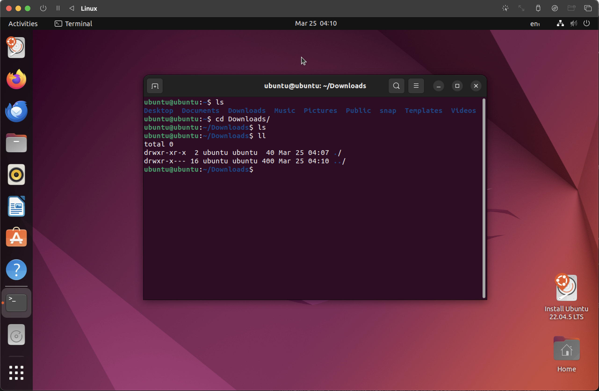

# devops-r_d

## Lecture 3 - Virtualization/VBox

# UTM Virtual Machine Setup Guide

### Download UTM from [UTM Official Website](https://mac.getutm.app/)

### Create a new VM
- **Type:** Linux
- **Version:** Ubuntu (64-bit)

## OS Installation
Download the latest Ubuntu LTS version (Long Term Support) ISO image from the official website: [Ubuntu Download](https://ubuntu.com/download)

### Install Ubuntu on VM
Follow the installation steps to set up Ubuntu on the virtual machine.

## Saving and Restoring VM State
Created files under `~./Document`

### VM Restored After Reboot

## Change VM Parameters Through the Graphical Interface

### Before Storage and CPU Update

### After VM Settings Update

